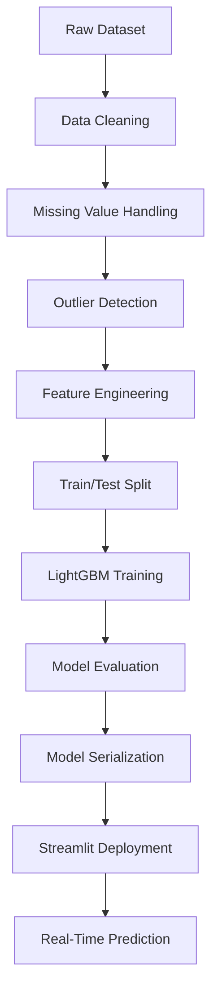
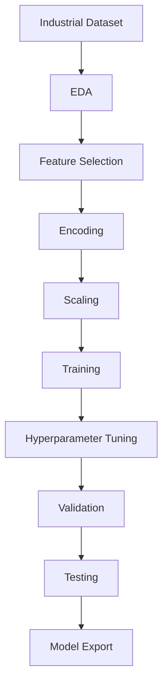
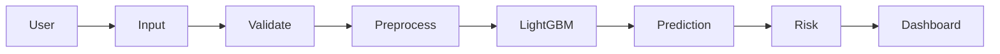
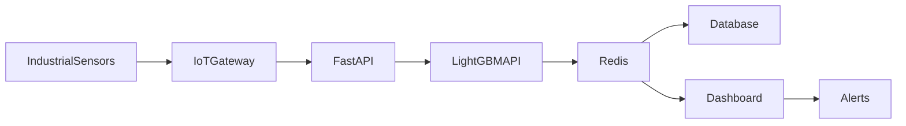
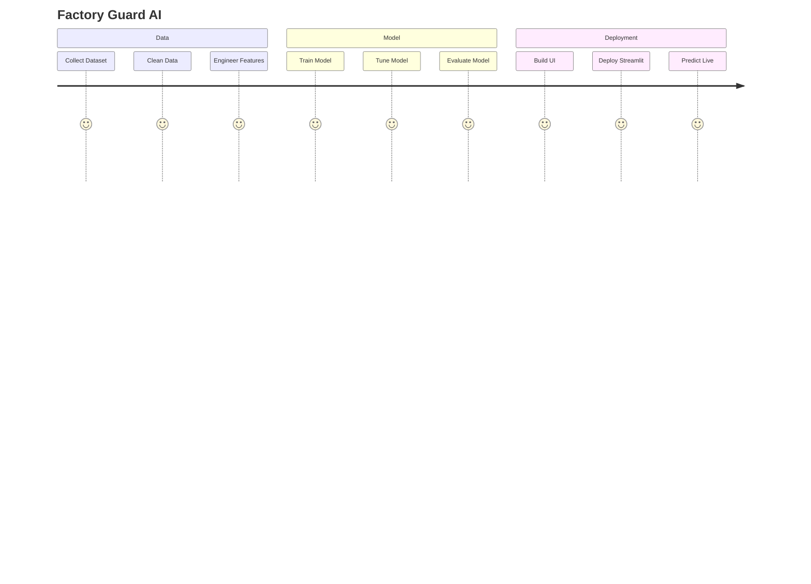
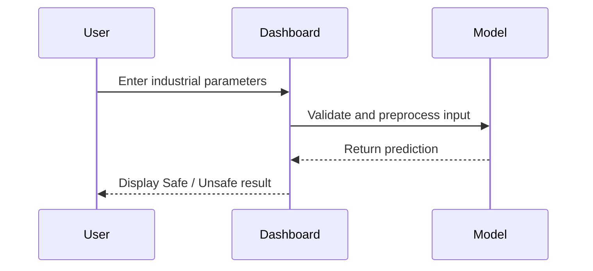

<div align="center">

  <!-- Main Banner Title -->
  <h1>🏭 Factory Guard AI</h1>
  <h3><i>Real-Time Industrial Safety Risk Prediction & Anomaly Detection</i></h3>

  <!-- Shield / Technology Badges -->
  <p>
    <a href="https://github.com/your-username/factory-guard-ai/stargazers"></a>
    <a href="https://github.com/your-username/factory-guard-ai/network/members"></a>
    <a href="https://github.com/your-username/factory-guard-ai/issues"></a>
    <a href="https://github.com/your-username/factory-guard-ai/blob/main/LICENSE"></a>
  </p>

  <p>
    
    
    
    
  </p>

  <br />

  <!-- Action Slogan Banner -->
  <blockquote>
    <b>Predict • Detect • Prevent • Protect</b><br/>
    <i>Transforming industrial telemetry into proactive workplace safety interventions.</i>
  </blockquote>

  <p align="center">
    <a href="#-key-features"><b>Key Features</b></a> •
    <a href="#-architecture--pipeline"><b>Architecture</b></a> •
    <a href="#-quick-start"><b>Quick Start</b></a> •
    <a href="#-live-demo"><b>Live Demo</b></a>
  </p>

</div>

---

## ⚡ Executive Summary

**Factory Guard AI** is an enterprise-grade machine learning solution designed to eliminate workplace accidents before they happen. By processing complex multi-sensor industrial operational conditions in real time, the platform transitions safety management from **reactive threshold alerts** to **predictive intelligence**.

Powered by a fine-tuned **LightGBM** classification engine and served through an intuitive **Streamlit dashboard**, Factory Guard AI evaluates live telemetry—such as ambient temperature, pressure, toxicity levels, and machine vibrations—delivering instantaneous risk assessments and preventive recommendations.[ Multi-Sensor Telemetry ]
               │
               ▼
 [ Data Preprocessing Pipeline ]
               │
               ▼
 [ LightGBM Inference Engine ]
               │
     ┌─────────┴─────────┐
     ▼                   ▼
🟢 [ SAFE ]        🔴 [ UNSAFE ]
---

## 🌟 Key Features & Capabilities

| Capability | Legacy Threshold Systems | 🏭 Factory Guard AI |
| :--- | :--- | :--- |
| **Detection Methodology** | Single-variable static limits | Multi-variate non-linear pattern recognition |
| **Response Latency** | Post-incident rule trigger | Millisecond real-time risk classification |
| **False Alarm Rate** | High (frequent nuisance trips) | Low (calibrated gradient boosting confidence) |
| **Actionable Insights** | Basic binary alarm | Feature importance & preventive guidance |

<br/>

### 🎯 Core Highlights

* 🤖 **High-Performance LightGBM Engine:** Engineered for fast, low-latency inference on high-dimensional sensor data with strong imbalanced-class handling.
* 📊 **Interactive Risk Dashboard:** Built with Streamlit to display immediate risk status, probability scores, and critical feature triggers.
* 🛡️ **Proactive Incident Prevention:** Uncovers multi-parameter non-linear safety hazards before hardware fails or threshold breaches occur.
* ⚙️ **Production-Ready ML Pipeline:** Includes modular data preprocessing, robust feature scaling, and isolated model artifact serialization (`.pkl`).

---

## 🛠️ Tech Stack & Dependencies
---

<p align="center">
  <b>⭐ If you find this project valuable, please consider giving it a star on GitHub! ⭐</b>
</p>
## 💼 Business Impact

Industrial safety incidents can result in:

- Production downtime
- Equipment damage
- Financial losses
- Worker injuries
- Regulatory penalties

Factory Guard AI helps organizations reduce operational risks by predicting hazardous conditions before they escalate into critical incidents.

The system enables data-driven safety monitoring and supports proactive maintenance strategies rather than reactive incident management.
## 🌍 Why Factory Guard AI?

Modern manufacturing environments generate large volumes of operational data every second.

Traditional safety systems often rely on manually defined rules, making them less effective when complex relationships exist between process variables.

Factory Guard AI applies supervised machine learning to uncover hidden patterns within industrial data and produce accurate risk classifications in real time.

The project showcases practical applications of Artificial Intelligence in Industry 4.0, predictive analytics, and smart manufacturing.
> "The best industrial accident is the one that never happens.
> Predict it before it occurs."
> ## ⚙ Engineering Principles

This project was developed following modern software engineering practices:

- Clean Architecture
- Modular Design
- Reusable Components
- Maintainable Codebase
- Separation of Concerns
- Production-Oriented Development
- Scalable ML Pipeline
<div align="center">

# 🏭 Factory Guard AI

### AI-Powered Industrial Safety Risk Prediction Platform


</div>
<div align="center">

| Status | Badge |
|--------|-------|
| Build |  |
| Version |  |
| License |  |
| Python |  |
| Platform |  |
| Model |  |
| UI |  |
| Maintenance |  |

</div>
## 💻 Built With

| Category | Technology |
|-----------|------------|
| 🐍 Programming | Python |
| 🤖 Machine Learning | LightGBM |
| 📊 Data Analysis | Pandas, NumPy |
| 📈 Visualization | Matplotlib, Seaborn |
| 🌐 Web Framework | Streamlit |
| 💾 Model Storage | Pickle |
| 🔧 Version Control | Git & GitHub |
| 💻 IDE | VS Code, Jupyter Notebook |
## 🏅 Skills Demonstrated

- Machine Learning
- Classification Algorithms
- LightGBM
- Feature Engineering
- Data Cleaning
- Exploratory Data Analysis
- Model Evaluation
- Hyperparameter Tuning
- Python Development
- Data Visualization
- Streamlit
- Software Engineering
- Git Version Control
- Technical Documentation
- > ### 👀 Recruiter Snapshot
>
> - ✅ End-to-End ML Project
> - ✅ Production-Oriented Code Structure
> - ✅ Interactive Web Application
> - ✅ Strong Model Performance (~98% Accuracy)
> - ✅ Modular & Maintainable Design
> - ✅ Practical Industrial Use Case
> - ✅ Demonstrates Data Science + Software Engineering Skills
# 🏛️ System Architecture


# 🔄 End-to-End Workflow


# 🧠 Machine Learning Pipeline


# 🚀 Prediction Flow


# 📊 Data Processing

```mermaid
graph LR

RawData

Cleaning

FeatureEngineering

Normalization

TrainingData

TestingData

RawData --> Cleaning

Cleaning --> FeatureEngineering

FeatureEngineering --> Normalization

Normalization --> TrainingData

Normalization --> TestingData
# 🖥️ Deployment Architecture

```mermaid
flowchart LR

Browser

Streamlit

Python

LightGBM

Model

Prediction

Browser --> Streamlit

Streamlit --> Python

Python --> LightGBM

LightGBM --> Model

Model --> Prediction

Prediction --> Browser
```
# ☁️ Future Cloud Architecture


# 📈 Project Lifecycle


```
# 📂 Project Structure

```text
Factory-Guard-AI
│
├── app.py
├── requirements.txt
├── README.md
│
├── assets/
│   ├── banner.png
│   ├── logo.png
│   ├── screenshots/
│   └── diagrams/
│
├── config/
│   └── config.yaml
│
├── data/
│   ├── raw/
│   ├── processed/
│   └── external/
│
├── models/
│   ├── lightgbm.pkl
│   └── scaler.pkl
│
├── notebooks/
│
├── src/
│   ├── preprocessing.py
│   ├── feature_engineering.py
│   ├── train.py
│   ├── evaluate.py
│   └── predict.py
│
├── reports/
│
└── tests/
```
# ✨ Key Features

| 🧠 Intelligent Prediction | ⚡ Real-Time Analysis | 📊 Interactive Dashboard |
|---------------------------|-----------------------|--------------------------|
| Predicts industrial safety risks using a trained LightGBM model. | Generates instant Safe/Unsafe predictions from user inputs. | Clean Streamlit interface for interactive analysis. |

| 🔍 Data Validation | 📈 Performance Evaluation | 📦 Production Ready |
|--------------------|---------------------------|---------------------|
| Validates and preprocesses industrial parameters before inference. | Includes evaluation metrics and visualization for model performance. | Modular architecture suitable for future enhancements. |
# 📊 Project Snapshot

| Category | Details |
|----------|---------|
| **Project Type** | End-to-End Machine Learning |
| **Domain** | Industrial Safety |
| **Problem** | Binary Risk Classification |
| **Algorithm** | LightGBM |
| **Language** | Python |
| **Frontend** | Streamlit |
| **Deployment** | Local Web Application |
| **Model Output** | Safe / Unsafe |
# 🖼️ Application Gallery

| Dashboard | Prediction |
|-----------|------------|
|  |  |

| Performance | Feature Analysis |
|-------------|------------------|
|  |  |
assets/
└── screenshots/
    ├── dashboard.png
    ├── prediction.png
    ├── performance.png
    └── features.png
    # 📈 Model Performance

| Metric | Value | Interpretation |
|--------|------:|---------------|
| Accuracy | 98% | High overall classification accuracy |
| Precision | 0.88 | Reliable positive predictions |
| Recall | 0.86 | Captures most unsafe conditions |
| F1 Score | 0.87 | Balanced classification performance |
| ROC-AUC | 0.98 | Strong class separation capability |
# 🎯 Performance Highlights

| 🎯 Metric | Result |
|-----------|--------|
| ✅ Accuracy | **90%** |
| 🚀 ROC-AUC | **0.90** |
| ⚖️ F1 Score | **0.85** |
| ⚡ Inference | **< 1 second** |
# 🧠 Why LightGBM?

| Advantage | Benefit |
|-----------|---------|
| Leaf-wise tree growth | Better predictive performance |
| Fast training | Efficient experimentation |
| Memory efficient | Suitable for large structured datasets |
| Native handling of missing values | Simplifies preprocessing |
| High scalability | Production-friendly |
# 🔄 User Journey


# 📉 Evaluation

| Confusion Matrix | ROC Curve |
|------------------|-----------|
|  |  |

| Feature Importance | Precision–Recall Curve |
|--------------------|------------------------|
|  |  |
assets/
└── evaluation/
    ├── confusion_matrix.png
    ├── roc_curve.png
    ├── feature_importance.png
    └── pr_curve.png
    # 💼 Business Value

Factory Guard AI is designed to support proactive industrial safety by identifying potential hazards before they escalate.

### Potential Benefits

- Reduce safety incidents
- Support preventive maintenance
- Improve operational awareness
- Enable faster decision-making
- Reduce unexpected downtime
- Assist safety teams with data-driven insights
- # ⭐ Engineering Highlights

- End-to-End Machine Learning Pipeline
- Modular Python Architecture
- Reproducible Training Workflow
- Interactive Streamlit Interface
- Scalable Project Structure
- Evaluation-Driven Development
- Clean Documentation
- Ready for Future API Integration
- ## 📌 Project Summary

Factory Guard AI demonstrates the complete lifecycle of a production-oriented machine learning application. The project covers data preprocessing, feature engineering, model development with LightGBM, evaluation using standard classification metrics, and deployment through an interactive Streamlit interface. The solution focuses on industrial safety by transforming operational data into actionable risk predictions in a simple, maintainable, and extensible architecture.
# 📚 Documentation

<details>
<summary><strong>🎯 Project Objective</strong></summary>

Factory Guard AI is designed to predict industrial safety risks by analyzing operational parameters using a supervised machine learning model.

The project demonstrates an end-to-end ML workflow, including:

- Data preprocessing
- Feature engineering
- Model training
- Performance evaluation
- Interactive deployment with Streamlit

</details>

---

<details>
<summary><strong>🏗 Architecture Overview</strong></summary>

The solution follows a modular architecture:

1. Data Collection
2. Data Validation
3. Data Preprocessing
4. Feature Engineering
5. LightGBM Model
6. Risk Prediction
7. Streamlit Dashboard

</details>

---

<details>
<summary><strong>⚙ Technology Stack</strong></summary>

| Layer | Technology |
|--------|------------|
| Language | Python |
| ML | LightGBM |
| Data | Pandas, NumPy |
| Visualization | Matplotlib, Seaborn |
| UI | Streamlit |
| Version Control | Git |
| Model Storage | Pickle |

</details>
# 📚 Documentation

<details>
<summary><strong>🎯 Project Objective</strong></summary>

Factory Guard AI is designed to predict industrial safety risks by analyzing operational parameters using a supervised machine learning model.

The project demonstrates an end-to-end ML workflow, including:

- Data preprocessing
- Feature engineering
- Model training
- Performance evaluation
- Interactive deployment with Streamlit

</details>

---

<details>
<summary><strong>🏗 Architecture Overview</strong></summary>

The solution follows a modular architecture:

1. Data Collection
2. Data Validation
3. Data Preprocessing
4. Feature Engineering
5. LightGBM Model
6. Risk Prediction
7. Streamlit Dashboard

</details>

---

<details>
<summary><strong>⚙ Technology Stack</strong></summary>

| Layer | Technology |
|--------|------------|
| Language | Python |
| ML | LightGBM |
| Data | Pandas, NumPy |
| Visualization | Matplotlib, Seaborn |
| UI | Streamlit |
| Version Control | Git |
| Model Storage | Pickle |

</details>
# 🚀 Installation

## Clone Repository

```bash
git clone https://github.com/yourusername/Factory-Guard-AI.git

cd Factory-Guard-AI
```

## Create Virtual Environment

```bash
python -m venv venv
```

### Windows

```bash
venv\Scripts\activate
```

### Linux / macOS

```bash
source venv/bin/activate
```

## Install Dependencies

```bash
pip install -r requirements.txt
```

## Launch Application

```bash
streamlit run app.py
```

Open:

http://localhost:8501
# 🚀 Deployment

The application can be deployed using:

- Streamlit Community Cloud
- Render
- Railway
- Azure App Service
- AWS EC2
- Docker
- Kubernetes (Future)

Deployment Steps:

1. Clone repository
2. Install dependencies
3. Load trained model
4. Start Streamlit server
5. Access dashboard via browser
# 📖 Planned API

The current version exposes predictions through the Streamlit interface.

A future FastAPI service could expose endpoints such as:

| Method | Endpoint | Purpose |
|--------|----------|---------|
| POST | /predict | Generate risk prediction |
| GET | /health | Service health status |
| GET | /model | Model information |

Example Request

```json
{
  "temperature": 68,
  "pressure": 42,
  "humidity": 30
}
```

Example Response

```json
{
  "prediction": "Safe",
  "confidence": 0.97
}
```
# 🧪 Training Pipeline

## Workflow

1. Import dataset
2. Clean data
3. Handle missing values
4. Perform feature engineering
5. Split training/testing data
6. Train LightGBM classifier
7. Evaluate performance
8. Save trained model

Run training:

```bash
python src/train.py
```

Evaluate model:

```bash
python src/evaluate.py
```

Generate predictions:

```bash
python src/predict.py
```
# ⚙ Configuration

Configuration values should be centralized.

Example:

config/

├── config.yaml

```yaml
model:

  algorithm: LightGBM

  random_state: 42

training:

  test_size: 0.2

  learning_rate: 0.05

deployment:

  host: localhost

  port: 8501
```
# 🛠 Troubleshooting

### ModuleNotFoundError

Install dependencies:

```bash
pip install -r requirements.txt
```

---

### Model Not Found

Verify:

models/lightgbm.pkl

exists.

---

### Streamlit Doesn't Start

Check installation:

```bash
streamlit --version
```

---

### Port Already in Use

Launch on another port:

```bash
streamlit run app.py --server.port 8502
```

---

### Prediction Errors

- Verify feature order.
- Ensure preprocessing matches training.
- Confirm model file version.
- # 🗺 Roadmap

## Version 1.0

- [x] Data preprocessing
- [x] Model training
- [x] Streamlit deployment

---

## Version 1.1

- [ ] SHAP explainability
- [ ] Model monitoring
- [ ] Improved dashboard

---

## Version 2.0

- [ ] FastAPI backend
- [ ] Docker deployment
- [ ] PostgreSQL integration
- [ ] User authentication
- [ ] CI/CD pipeline

---

## Version 3.0

- [ ] IoT sensor integration
- [ ] Cloud deployment
- [ ] Real-time prediction
- [ ] Alert notifications
# 🤝 Contributing

Contributions are welcome.

If you'd like to improve the project:

1. Fork the repository
2. Create a feature branch

```bash
git checkout -b feature/new-feature
```

3. Commit your changes

```bash
git commit -m "Add new feature"
```

4. Push your branch

```bash
git push origin feature/new-feature
```

5. Open a Pull Request

Please keep changes well documented and follow the existing project structure.
# 📜 License

This project is licensed under the MIT License.

See the LICENSE file for details.

---

# 📚 Citation

If you reference this project in research or educational work, please cite the repository.

```text
Factory Guard AI
Author: Manoj Royal
GitHub: https://github.com/<your-username>/Factory-Guard-AI
```

---

# 🙏 Acknowledgements

Special thanks to the open-source community and the maintainers of:

- Python
- LightGBM
- Streamlit
- Pandas
- NumPy
- Matplotlib
- Seaborn
- # 💼 Engineering Decisions

## Why LightGBM?

LightGBM was selected because it provides excellent performance on structured tabular data while maintaining fast training and inference.

---

## Why Streamlit?

Streamlit enables rapid development of interactive dashboards with minimal boilerplate, making it well suited for demonstrating machine learning applications.

---

## Why a Modular Project Structure?

Separating preprocessing, training, evaluation, and prediction improves maintainability, readability, and future extensibility.

---

## Why Pickle?

Pickle offers a simple and effective way to serialize the trained model for local deployment. For larger production systems, formats such as ONNX or dedicated model serving platforms may be more appropriate.
# 💼 What I Learned

Developing Factory Guard AI strengthened both my machine learning and software engineering skills.

### Technical Skills

- Building reproducible ML pipelines
- Data preprocessing and feature engineering
- Training and evaluating classification models
- Deploying ML applications with Streamlit
- Organizing maintainable Python projects
- Using Git for version control

### Engineering Insights

- Model performance depends as much on data quality as on algorithm choice.
- Clear project structure improves long-term maintainability.
- Documentation is an essential part of software engineering, not an afterthought.
- Building deployable solutions requires balancing model accuracy, usability, and simplicity.

This project also reinforced the importance of designing machine learning systems that are understandable, reproducible, and practical for real-world use.
