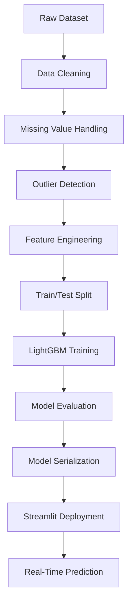
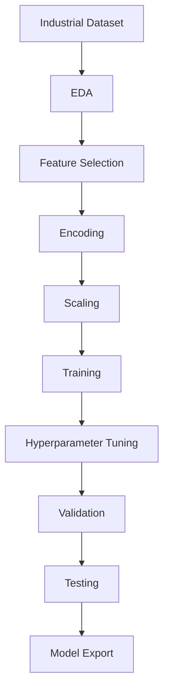
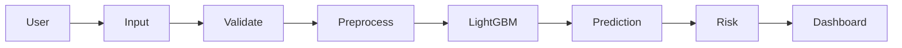
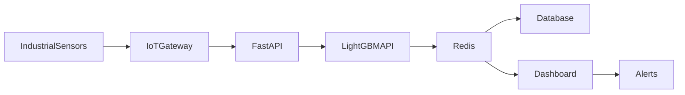
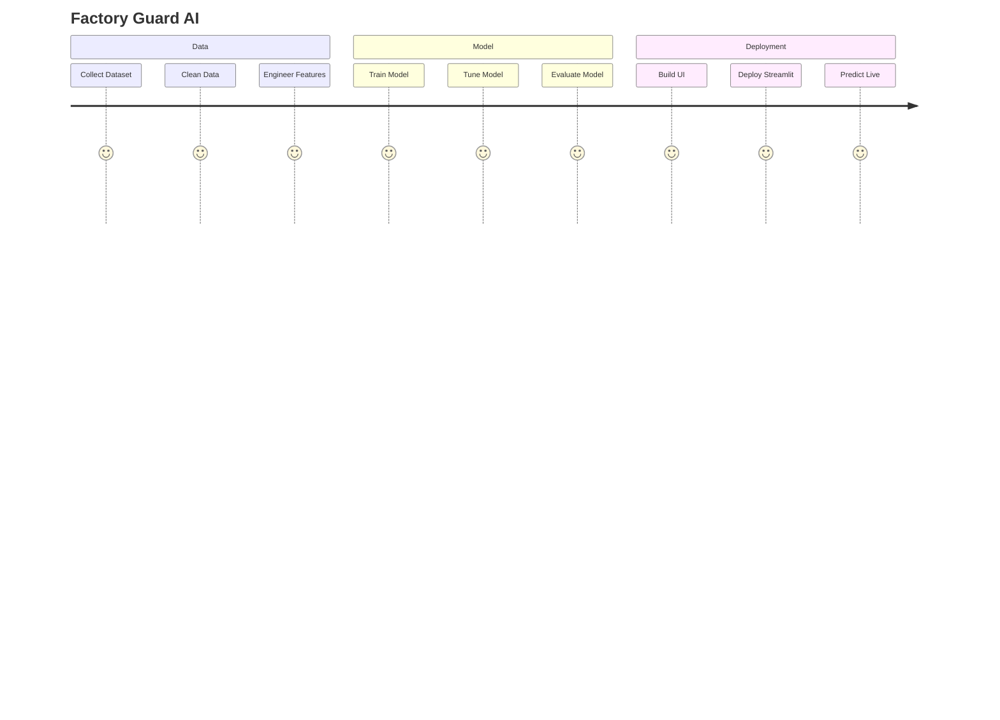
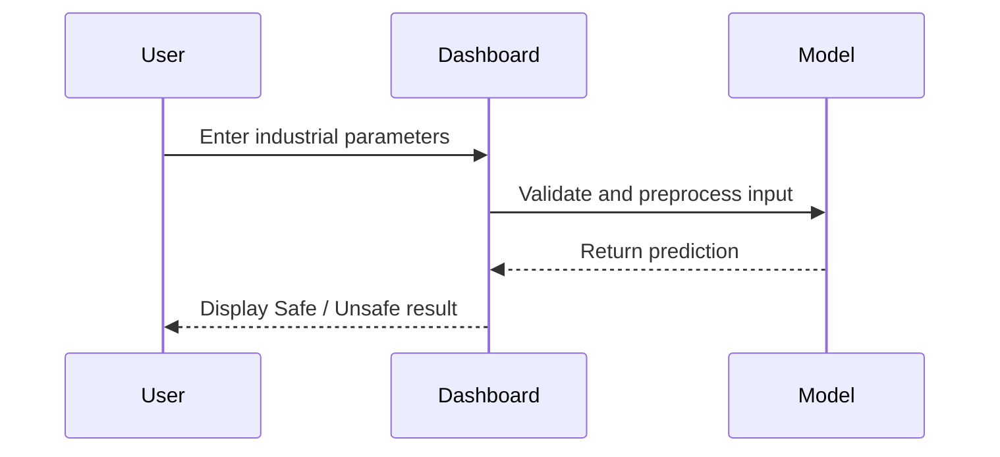

<!DOCTYPE html>
<html lang="en">
<head>
<meta charset="UTF-8">
<title>Factory Guard AI — Overview</title>
<style>
  @import url('https://fonts.googleapis.com/css2?family=Space+Grotesk:wght@400;500;600;700&family=Inter:wght@400;500;600&family=JetBrains+Mono:wght@400;500;700&display=swap');

  :root{
    --bg:#07080A;
    --panel:rgba(255,255,255,0.035);
    --line:rgba(255,255,255,0.08);
    --line-soft:rgba(255,255,255,0.05);
    --text:#EEF1F4;
    --muted:#8B95A3;
    --muted-dim:#5D6470;
    --amber:#FFB020;
    --amber-soft:#FFD27A;
    --copper:#FF7A45;
    --cyan:#4FE0C8;
    --safe:#2ED573;
    --danger:#FF4B5C;
    --mono:'JetBrains Mono', monospace;
    --disp:'Space Grotesk', sans-serif;
    --body:'Inter', sans-serif;
  }
  *{box-sizing:border-box; margin:0; padding:0;}
  html{scroll-behavior:smooth;}
  body{background:var(--bg); color:var(--text); font-family:var(--body); overflow-x:hidden; position:relative;}

  #field{position:fixed; inset:0; z-index:0; opacity:0.55;}
  .grain{
    position:fixed; inset:0; z-index:1; pointer-events:none; opacity:0.035;
    background-image:url("data:image/svg+xml,%3Csvg xmlns='http://www.w3.org/2000/svg' width='120' height='120'%3E%3Cfilter id='n'%3E%3CfeTurbulence type='fractalNoise' baseFrequency='0.9' numOctaves='2' stitchTiles='stitch'/%3E%3C/filter%3E%3Crect width='100%25' height='100%25' filter='url(%23n)'/%3E%3C/svg%3E");
  }
  .glow-spot{
    position:fixed; width:600px; height:600px; border-radius:50%; z-index:0;
    background:radial-gradient(circle, rgba(255,176,32,0.10), transparent 70%);
    filter:blur(40px); pointer-events:none; transition:transform .4s ease-out;
    top:-200px; right:-150px;
  }
  .glow-spot.b{background:radial-gradient(circle, rgba(79,224,200,0.07), transparent 70%); bottom:-250px; left:-200px; top:auto; right:auto;}

  .content{position:relative; z-index:2;}
  ::selection{background:rgba(255,176,32,0.3); color:#fff;}

  .stripe{height:3px; width:100%; background:linear-gradient(90deg, transparent, var(--amber) 15%, var(--copper) 50%, var(--amber) 85%, transparent); opacity:0.7;}

  nav{
    display:flex; align-items:center; justify-content:space-between;
    padding:24px 32px; max-width:1180px; margin:0 auto;
    position:sticky; top:0; z-index:50; backdrop-filter:blur(16px);
    background:rgba(7,8,10,0.55); border-bottom:1px solid var(--line-soft);
  }
  .brand{display:flex; align-items:center; gap:11px; font-family:var(--disp); font-weight:700; font-size:15px;}
  .brand-mark{
    width:32px; height:32px; border-radius:9px;
    background:linear-gradient(135deg, var(--amber), var(--copper));
    display:flex; align-items:center; justify-content:center; font-size:16px;
    box-shadow:0 0 24px rgba(255,176,32,0.4), inset 0 1px 1px rgba(255,255,255,0.3);
  }
  .status-pill{
    display:flex; align-items:center; gap:8px; font-family:var(--mono); font-size:11.5px; color:var(--safe);
    border:1px solid rgba(46,213,115,0.3); background:rgba(46,213,115,0.06);
    padding:7px 14px; border-radius:100px; backdrop-filter:blur(8px);
  }
  .dot{width:6px; height:6px; border-radius:50%; background:var(--safe); box-shadow:0 0 10px var(--safe); animation:pulse 2.4s infinite;}
  @keyframes pulse{0%,100%{opacity:1;} 50%{opacity:0.3;}}

  .hero{max-width:1180px; margin:0 auto; padding:80px 32px 40px; text-align:center;}
  .eyebrow{
    font-family:var(--mono); font-size:11.5px; letter-spacing:3px; color:var(--amber); text-transform:uppercase;
    display:inline-flex; align-items:center; gap:12px; margin-bottom:26px;
    opacity:0; animation:fadeUp .7s ease forwards;
  }
  .eyebrow::before,.eyebrow::after{content:''; width:26px; height:1px; background:linear-gradient(90deg, transparent, var(--amber), transparent);}
  h1{
    font-family:var(--disp); font-size:60px; line-height:1.04; font-weight:700; letter-spacing:-1.5px;
    margin-bottom:24px; opacity:0; animation:fadeUp .7s ease .1s forwards;
  }
  h1 .grad{background:linear-gradient(100deg, var(--amber-soft), var(--amber) 40%, var(--copper)); -webkit-background-clip:text; background-clip:text; color:transparent;}
  .lede{
    color:var(--muted); font-size:17px; line-height:1.75; max-width:600px; margin:0 auto 40px;
    opacity:0; animation:fadeUp .7s ease .2s forwards;
  }
  .lede strong{color:var(--text); font-weight:600;}
  .cta-row{display:flex; gap:14px; justify-content:center; opacity:0; animation:fadeUp .7s ease .3s forwards;}
  @keyframes fadeUp{from{opacity:0; transform:translateY(14px);} to{opacity:1; transform:translateY(0);}}

  .btn{
    font-family:var(--mono); font-size:12.5px; font-weight:500; padding:14px 24px; border-radius:10px;
    cursor:pointer; text-decoration:none; display:inline-flex; align-items:center; gap:8px;
    transition:all .25s cubic-bezier(.2,.8,.2,1);
  }
  .btn-primary{background:linear-gradient(135deg, var(--amber-soft), var(--amber)); color:#141414; border:none; box-shadow:0 4px 20px rgba(255,176,32,0.25);}
  .btn-primary:hover{transform:translateY(-2px); box-shadow:0 10px 28px rgba(255,176,32,0.4);}
  .btn-ghost{background:rgba(255,255,255,0.03); border:1px solid var(--line); color:var(--text); backdrop-filter:blur(8px);}
  .btn-ghost:hover{border-color:var(--amber); color:var(--amber-soft); background:rgba(255,176,32,0.05);}

  /* LIVE FACTORY PANEL — signature element */
  .live-panel{
    max-width:1180px; margin:56px auto 0; padding:0 32px;
    opacity:0; animation:fadeUp .9s ease .35s forwards;
  }
  .live-card{
    background:linear-gradient(160deg, rgba(255,255,255,0.05), rgba(255,255,255,0.015));
    border:1px solid var(--line); border-radius:22px; overflow:hidden; position:relative;
    box-shadow:0 30px 80px rgba(0,0,0,0.5), inset 0 1px 1px rgba(255,255,255,0.06);
  }
  .live-head{
    display:flex; align-items:center; justify-content:space-between;
    padding:16px 22px; border-bottom:1px solid var(--line-soft);
    font-family:var(--mono); font-size:11px; letter-spacing:1px; color:var(--muted-dim);
  }
  .live-head .l-left{display:flex; align-items:center; gap:10px;}
  .rec{width:7px; height:7px; border-radius:50%; background:var(--danger); box-shadow:0 0 10px var(--danger); animation:pulse 1.6s infinite;}
  .live-body{display:grid; grid-template-columns:1.4fr 1fr; min-height:340px;}

  /* left: animated factory schematic */
  .schematic{position:relative; padding:22px; border-right:1px solid var(--line-soft);}
  .schematic svg{width:100%; height:100%; display:block;}

  /* right: live readouts */
  .readouts{padding:22px; display:flex; flex-direction:column; gap:16px;}
  .ro-row{display:flex; align-items:center; justify-content:space-between; gap:14px;}
  .ro-label{font-family:var(--mono); font-size:10.5px; color:var(--muted-dim); letter-spacing:1px;}
  .ro-val{font-family:var(--disp); font-size:20px; font-weight:700;}
  .sparkline{flex:1; height:34px; margin:0 12px;}
  .sparkline path{fill:none; stroke-width:1.8;}

  .verdict-box{
    margin-top:auto; padding-top:18px; border-top:1px solid var(--line-soft);
    display:flex; align-items:center; justify-content:space-between;
  }
  .verdict-label{font-family:var(--mono); font-size:10.5px; color:var(--muted-dim); letter-spacing:1px;}
  .verdict-val{font-family:var(--disp); font-size:26px; font-weight:700; color:var(--safe); display:flex; align-items:center; gap:10px;}
  .verdict-val .conf{font-family:var(--mono); font-size:11px; color:var(--muted); font-weight:400;}

  .section{padding:70px 32px; max-width:1180px; margin:0 auto;}
  .section-head{display:flex; align-items:baseline; justify-content:space-between; margin-bottom:38px; gap:20px; flex-wrap:wrap;}
  .section-head h2{font-family:var(--disp); font-size:30px; font-weight:600; letter-spacing:-0.5px;}
  .section-head .idx{font-family:var(--mono); font-size:11.5px; color:var(--amber); letter-spacing:0.5px;}

  .reveal{opacity:0; transform:translateY(24px); transition:opacity .7s cubic-bezier(.2,.8,.2,1), transform .7s cubic-bezier(.2,.8,.2,1);}
  .reveal.show{opacity:1; transform:translateY(0);}

  .body-copy{color:var(--muted); font-size:15.5px; line-height:1.9; max-width:780px;}
  .body-copy strong{color:var(--text); font-weight:600;}
  .body-copy + .body-copy{margin-top:18px;}

  .grid{display:grid; grid-template-columns:repeat(2, 1fr); gap:14px;}
  .card{
    background:var(--panel); border:1px solid var(--line); border-radius:16px; padding:26px;
    position:relative; overflow:hidden; backdrop-filter:blur(12px);
    transition:transform .3s cubic-bezier(.2,.8,.2,1), border-color .3s ease, background .3s ease;
  }
  .card::after{
    content:''; position:absolute; inset:0; border-radius:16px; padding:1px;
    background:linear-gradient(135deg, rgba(255,176,32,0.4), transparent 50%);
    -webkit-mask:linear-gradient(#fff 0 0) content-box, linear-gradient(#fff 0 0);
    -webkit-mask-composite:xor; mask-composite:exclude; opacity:0; transition:opacity .3s ease;
  }
  .card:hover{transform:translateY(-4px); border-color:rgba(255,176,32,0.25); background:rgba(255,255,255,0.05);}
  .card:hover::after{opacity:1;}
  .card:hover .card-num{color:var(--amber);}
  .card-top{display:flex; align-items:center; justify-content:space-between; margin-bottom:16px;}
  .card-num{font-family:var(--mono); font-size:12px; color:var(--muted-dim); font-weight:700; transition:color .3s ease;}
  .check{
    width:22px; height:22px; border-radius:50%; background:rgba(46,213,115,0.08);
    border:1px solid rgba(46,213,115,0.35); display:flex; align-items:center; justify-content:center;
    font-size:11px; color:var(--safe); flex-shrink:0;
  }
  .card-title{font-family:var(--disp); font-size:17.5px; font-weight:600; margin-bottom:9px; letter-spacing:-0.2px;}
  .card-desc{font-family:var(--body); font-size:13.5px; color:var(--muted); line-height:1.65;}

  .strip{
    display:grid; grid-template-columns:repeat(4,1fr); gap:1px;
    background:var(--line-soft); border:1px solid var(--line-soft); border-radius:16px; overflow:hidden; margin-top:56px;
  }
  .strip-item{background:rgba(255,255,255,0.02); padding:26px 24px; text-align:center;}
  .strip-item .v{font-family:var(--disp); font-size:30px; font-weight:700; background:linear-gradient(135deg,var(--amber-soft),var(--copper)); -webkit-background-clip:text; background-clip:text; color:transparent;}
  .strip-item .l{font-family:var(--mono); font-size:10px; color:var(--muted-dim); letter-spacing:1px; margin-top:6px;}

  @media (max-width:900px){
    h1{font-size:40px;}
    .live-body{grid-template-columns:1fr;}
    .schematic{border-right:none; border-bottom:1px solid var(--line-soft);}
    .grid{grid-template-columns:1fr;}
    .strip{grid-template-columns:repeat(2,1fr);}
    nav{padding:18px 20px;}
  }

  footer{border-top:1px solid var(--line-soft); padding:34px 32px; text-align:center; font-family:var(--mono); font-size:11px; color:var(--muted-dim); letter-spacing:0.8px;}
</style>
</head>
<body>

<canvas id="field"></canvas>
<div class="grain"></div>
<div class="glow-spot" id="glowA"></div>
<div class="glow-spot b"></div>

<div class="content">

<nav>
  <div class="brand"><div class="brand-mark">🏭</div>FACTORY GUARD AI</div>
  <div class="status-pill"><span class="dot"></span>SYSTEM NOMINAL</div>
</nav>

<div class="stripe"></div>

<section class="hero">
  <div class="eyebrow">Industrial Safety Intelligence</div>
  <h1>Predict the incident<br>before it <span class="grad">happens</span>.</h1>
  <p class="lede">
    Factory Guard AI reads live operational conditions and classifies them
    <strong>Safe</strong> or <strong>Unsafe</strong> in real time — built on LightGBM,
    deployed through an interactive Streamlit dashboard.
  </p>
  <div class="cta-row">
    <a class="btn btn-primary" href="#highlights">View Highlights ↓</a>
    <a class="btn btn-ghost" href="#overview">Read Overview</a>
  </div>
</section>

<div class="live-panel">
  <div class="live-card">
    <div class="live-head">
      <div class="l-left"><span class="rec"></span>LIVE FACTORY FEED — LINE 04</div>
      <div id="clock">00:00:00</div>
    </div>
    <div class="live-body">
      <div class="schematic">
        <svg viewBox="0 0 560 320" preserveAspectRatio="xMidYMid meet">
          <defs>
            <linearGradient id="pipeGrad" x1="0" y1="0" x2="1" y2="0">
              <stop offset="0%" stop-color="#FFB020" stop-opacity="0"/>
              <stop offset="50%" stop-color="#FFB020" stop-opacity="1"/>
              <stop offset="100%" stop-color="#FFB020" stop-opacity="0"/>
            </linearGradient>
            <filter id="softGlow"><feGaussianBlur stdDeviation="3" result="b"/><feMerge><feMergeNode in="b"/><feMergeNode in="SourceGraphic"/></feMerge></filter>
          </defs>

          <!-- floor grid -->
          <g stroke="rgba(255,255,255,0.05)" stroke-width="1">
            <line x1="0" y1="280" x2="560" y2="280"/>
            <line x1="0" y1="240" x2="560" y2="240"/>
          </g>

          <!-- pipe network -->
          <g fill="none" stroke="rgba(255,255,255,0.12)" stroke-width="3" stroke-linecap="round">
            <path d="M 40 200 H 220 V 100 H 340"/>
            <path d="M 340 100 H 460 V 180"/>
            <path d="M 220 200 V 260 H 460 V 180"/>
          </g>

          <!-- traveling pulses -->
          <circle r="4" fill="#FFB020" filter="url(#softGlow)">
            <animateMotion dur="3.2s" repeatCount="indefinite" path="M 40 200 H 220 V 100 H 340"/>
          </circle>
          <circle r="4" fill="#4FE0C8" filter="url(#softGlow)">
            <animateMotion dur="4s" repeatCount="indefinite" path="M 220 200 V 260 H 460 V 180"/>
          </circle>
          <circle r="3.5" fill="#FF7A45" filter="url(#softGlow)">
            <animateMotion dur="2.6s" repeatCount="indefinite" path="M 340 100 H 460 V 180"/>
          </circle>

          <!-- nodes: sensors -->
          <g font-family="JetBrains Mono" font-size="9" fill="#8B95A3">
            <g>
              <circle cx="40" cy="200" r="7" fill="#12151A" stroke="#2ED573" stroke-width="2"/>
              <circle cx="40" cy="200" r="2.5" fill="#2ED573"/>
              <text x="40" y="222" text-anchor="middle">TEMP</text>
            </g>
            <g>
              <circle cx="220" cy="100" r="7" fill="#12151A" stroke="#2ED573" stroke-width="2"/>
              <circle cx="220" cy="100" r="2.5" fill="#2ED573"/>
              <text x="220" y="86" text-anchor="middle">PRESSURE</text>
            </g>
            <g>
              <circle cx="460" cy="180" r="9" fill="#12151A" stroke="#FFB020" stroke-width="2.5"/>
              <circle cx="460" cy="180" r="3" fill="#FFB020"/>
              <text x="460" y="205" text-anchor="middle" fill="#FFB020">CORE UNIT</text>
            </g>
            <g>
              <circle cx="220" cy="260" r="7" fill="#12151A" stroke="#2ED573" stroke-width="2"/>
              <circle cx="220" cy="260" r="2.5" fill="#2ED573"/>
              <text x="220" y="278" text-anchor="middle">HUMIDITY</text>
            </g>
            <g>
              <circle cx="340" cy="100" r="7" fill="#12151A" stroke="#2ED573" stroke-width="2"/>
              <circle cx="340" cy="100" r="2.5" fill="#2ED573"/>
              <text x="340" y="86" text-anchor="middle">VIBRATION</text>
            </g>
          </g>

          <!-- core unit pulse ring -->
          <circle cx="460" cy="180" r="9" fill="none" stroke="#FFB020" stroke-width="1.5" opacity="0.6">
            <animate attributeName="r" values="9;22;9" dur="2.4s" repeatCount="indefinite"/>
            <animate attributeName="opacity" values="0.6;0;0.6" dur="2.4s" repeatCount="indefinite"/>
          </circle>
        </svg>
      </div>

      <div class="readouts">
        <div class="ro-row">
          <span class="ro-label">TEMP</span>
          <svg class="sparkline" viewBox="0 0 140 34" preserveAspectRatio="none"><path id="spark1" stroke="#2ED573"/></svg>
          <span class="ro-val" id="v1">68°C</span>
        </div>
        <div class="ro-row">
          <span class="ro-label">PRESSURE</span>
          <svg class="sparkline" viewBox="0 0 140 34" preserveAspectRatio="none"><path id="spark2" stroke="#4FE0C8"/></svg>
          <span class="ro-val" id="v2">42 psi</span>
        </div>
        <div class="ro-row">
          <span class="ro-label">HUMIDITY</span>
          <svg class="sparkline" viewBox="0 0 140 34" preserveAspectRatio="none"><path id="spark3" stroke="#FFB020"/></svg>
          <span class="ro-val" id="v3">30%</span>
        </div>
        <div class="ro-row">
          <span class="ro-label">VIBRATION</span>
          <svg class="sparkline" viewBox="0 0 140 34" preserveAspectRatio="none"><path id="spark4" stroke="#FF7A45"/></svg>
          <span class="ro-val" id="v4">0.4g</span>
        </div>

        <div class="verdict-box">
          <span class="verdict-label">CLASSIFICATION</span>
          <span class="verdict-val" id="verdictVal">SAFE <span class="conf" id="verdictConf">91.4% conf.</span></span>
        </div>
      </div>
    </div>
  </div>
</div>

<section class="section" id="overview">
  <div class="section-head reveal">
    <h2>Overview</h2>
    <span class="idx">// 01 — WHAT IT IS</span>
  </div>
  <div class="body-copy reveal">
    <p>Factory Guard AI is an end-to-end machine learning solution built to strengthen industrial
    workplace safety through intelligent risk prediction. It analyzes operational conditions,
    runs them through a trained <strong>LightGBM classification model</strong>, and instantly returns
    whether the current environment reads as <strong>Safe</strong> or <strong>Unsafe</strong>.</p>
    <p>Unlike threshold-based monitoring — which only reacts once a single value crosses a line
    someone guessed at — Factory Guard AI learns the complex relationships between operational
    variables, enabling teams to act before conditions escalate into incidents.</p>
    <p>The project covers the full ML lifecycle: data preprocessing, feature engineering, model
    training and evaluation, and deployment through an interactive Streamlit web application —
    built with the scalability and modularity of a real production system, not a one-off script.</p>
  </div>

  <div class="strip reveal">
    <div class="strip-item"><div class="v">90%</div><div class="l">ACCURACY</div></div>
    <div class="strip-item"><div class="v">0.85</div><div class="l">F1 SCORE</div></div>
    <div class="strip-item"><div class="v">0.90</div><div class="l">ROC-AUC</div></div>
    <div class="strip-item"><div class="v">&lt;1s</div><div class="l">INFERENCE</div></div>
  </div>
</section>

<section class="section" id="highlights">
  <div class="section-head reveal">
    <h2>Ten Reasons This Holds Up</h2>
    <span class="idx">// 02 — HIGHLIGHTS</span>
  </div>
  <div class="grid" id="cardGrid"></div>
</section>

<div class="stripe"></div>
<footer>FACTORY GUARD AI · BUILT WITH PYTHON, LIGHTGBM &amp; STREAMLIT</footer>

</div>

<script>
  // ambient particle field
  const canvas = document.getElementById('field');
  const ctx = canvas.getContext('2d');
  let w, h, particles = [];
  function resize(){ w = canvas.width = window.innerWidth; h = canvas.height = window.innerHeight; }
  resize(); window.addEventListener('resize', resize);
  const N = Math.min(60, Math.floor(window.innerWidth/22));
  for(let i=0;i<N;i++){
    particles.push({x:Math.random()*w, y:Math.random()*h, r:Math.random()*1.4+0.4, vx:(Math.random()-0.5)*0.15, vy:(Math.random()-0.5)*0.15, a:Math.random()*0.5+0.15});
  }
  function tick(){
    ctx.clearRect(0,0,w,h);
    particles.forEach(p=>{
      p.x+=p.vx; p.y+=p.vy;
      if(p.x<0)p.x=w; if(p.x>w)p.x=0; if(p.y<0)p.y=h; if(p.y>h)p.y=0;
      ctx.beginPath(); ctx.arc(p.x,p.y,p.r,0,Math.PI*2);
      ctx.fillStyle=`rgba(255,176,32,${p.a*0.6})`; ctx.fill();
    });
    requestAnimationFrame(tick);
  }
  tick();

  const glowA = document.getElementById('glowA');
  window.addEventListener('mousemove', e=>{
    glowA.style.transform = `translate(${(e.clientX-window.innerWidth/2)*0.06}px, ${(e.clientY-window.innerHeight/2)*0.06}px)`;
  });

  const obs = new IntersectionObserver(entries=>{ entries.forEach(en=>{ if(en.isIntersecting) en.target.classList.add('show'); }); }, {threshold:0.15});
  document.querySelectorAll('.reveal').forEach(el=>obs.observe(el));

  const highlights = [
    {t:"End-to-End ML Project", d:"Full lifecycle coverage — raw data to deployed prediction, nothing skipped or mocked."},
    {t:"Real Industry Problem", d:"Solves an actual operational pain point, not a synthetic Kaggle exercise."},
    {t:"Production-Style Deployment", d:"Streamlit dashboard built to be used, not just demoed once and forgotten."},
    {t:"Modular Architecture", d:"Preprocessing, training, evaluation, and prediction live in clean, separate modules."},
    {t:"LightGBM Classification", d:"Gradient-boosted trees chosen deliberately for structured, tabular sensor data."},
    {t:"Proper Data Pipeline", d:"Validation, cleaning, and feature engineering run consistently at train and inference time."},
    {t:"Interactive Dashboard", d:"Live Safe/Unsafe predictions with confidence scores, not a static report."},
    {t:"Rigorous Evaluation", d:"Accuracy, precision, recall, F1, and ROC-AUC — measured, not asserted."},
    {t:"Clean, Readable Code", d:"Structured so the next person — or future you — can actually extend it."},
    {t:"Built to Scale Further", d:"Clear roadmap toward FastAPI, Docker, and live IoT ingestion."}
  ];
  const grid = document.getElementById('cardGrid');
  highlights.forEach((hl, i) => {
    const card = document.createElement('div');
    card.className = 'card reveal';
    card.style.transitionDelay = (i%2)*0.06 + 's';
    card.innerHTML = `<div class="card-top"><span class="card-num">${String(i+1).padStart(2,'0')}</span><span class="check">✓</span></div>
      <div class="card-title">${hl.t}</div><div class="card-desc">${hl.d}</div>`;
    grid.appendChild(card);
    obs.observe(card);
  });

  // live clock
  function tickClock(){
    document.getElementById('clock').textContent = new Date().toLocaleTimeString('en-GB');
  }
  tickClock(); setInterval(tickClock, 1000);

  // live sensor simulation
  const series = {v1:[68,68,68,68,68,68,68,68,68,68], v2:[42,42,42,42,42,42,42,42,42,42], v3:[30,30,30,30,30,30,30,30,30,30], v4:[0.4,0.4,0.4,0.4,0.4,0.4,0.4,0.4,0.4,0.4]};
  const cfg = {v1:{min:60,max:78,unit:'°C',id:'spark1'}, v2:{min:35,max:52,unit:' psi',id:'spark2'}, v3:{min:22,max:40,unit:'%',id:'spark3'}, v4:{min:0.1,max:0.9,unit:'g',id:'spark4'}};

  function toPath(arr,min,max){
    const w=140,h=34,n=arr.length;
    return arr.map((v,i)=>{
      const x = (i/(n-1))*w;
      const y = h - ((v-min)/(max-min))*h;
      return (i===0?'M':'L') + x.toFixed(1) + ' ' + y.toFixed(1);
    }).join(' ');
  }

  function step(){
    let riskSignal = 0;
    Object.keys(series).forEach(k=>{
      const c = cfg[k];
      let last = series[k][series[k].length-1];
      let next = last + (Math.random()-0.5)*(c.max-c.min)*0.06;
      next = Math.max(c.min, Math.min(c.max, next));
      series[k].push(next); series[k].shift();
      document.getElementById(c.id).setAttribute('d', toPath(series[k], c.min, c.max));
      const displayVal = k==='v4' ? next.toFixed(1) : Math.round(next);
      document.getElementById(k).textContent = displayVal + c.unit;
      // risk contribution: how close to max edge
      riskSignal += (next - c.min) / (c.max - c.min);
    });
    const avgRisk = riskSignal / 4;
    const verdictEl = document.getElementById('verdictVal');
    const confEl = document.getElementById('verdictConf');
    if(avgRisk > 0.72){
      verdictEl.style.color = 'var(--danger)';
      verdictEl.innerHTML = 'UNSAFE <span class="conf" id="verdictConf">' + (avgRisk*100).toFixed(1) + '% conf.</span>';
    } else {
      verdictEl.style.color = 'var(--safe)';
      verdictEl.innerHTML = 'SAFE <span class="conf" id="verdictConf">' + ((1-avgRisk*0.6)*100).toFixed(1) + '% conf.</span>';
    }
  }
  setInterval(step, 1400);
</script>

</body>
</html>
## 💼 Business Impact

Industrial safety incidents can result in:

- Production downtime
- Equipment damage
- Financial losses
- Worker injuries
- Regulatory penalties
  ## 🌍 Why Factory Guard AI?

Modern manufacturing environments generate large volumes of operational data every second.

Traditional safety systems often rely on manually defined rules, making them less effective when complex relationships exist between process variables.

Factory Guard AI applies supervised machine learning to uncover hidden patterns within industrial data and produce accurate risk classifications in real time.

The project showcases practical applications of Artificial Intelligence in Industry 4.0, predictive analytics, and smart manufacturing.

Factory Guard AI helps organizations reduce operational risks by predicting hazardous conditions before they escalate into critical incidents.

The system enables data-driven safety monitoring and supports proactive maintenance strategies rather than reactive incident management.
> "The best industrial accident is the one that never happens.
> Predict it before it occurs."
## ⚙ Engineering Principles

This project was developed following modern software engineering practices:

- Clean Architecture
- Modular Design
- Reusable Components
- Maintainable Codebase
- Separation of Concerns
- Production-Oriented Development
- Scalable ML Pipeline
  Factory-Guard-AI
│
├── assets/
│     └── banner.png
│
├── data/
│
├── models/
│
├── notebooks/
│
├── app.py
│
├── requirements.txt
│
└── README.md


### AI-Powered Industrial Safety Risk Prediction Platform


</div>
<div align="center">

| Status | Badge |
|--------|-------|
| Build |  |
| Version |  |
| License |  |
| Python |  |
| Platform |  |
| Model |  |
| UI |  |
| Maintenance |  |

</div>
## 💻 Built With

| Category | Technology |
|-----------|------------|
| 🐍 Programming | Python |
| 🤖 Machine Learning | LightGBM |
| 📊 Data Analysis | Pandas, NumPy |
| 📈 Visualization | Matplotlib, Seaborn |
| 🌐 Web Framework | Streamlit |
| 💾 Model Storage | Pickle |
| 🔧 Version Control | Git & GitHub |
| 💻 IDE | VS Code, Jupyter Notebook |
## 🏅 Skills Demonstrated

- Machine Learning
- Classification Algorithms
- LightGBM
- Feature Engineering
- Data Cleaning
- Exploratory Data Analysis
- Model Evaluation
- Hyperparameter Tuning
- Python Development
- Data Visualization
- Streamlit
- Software Engineering
- Git Version Control
- Technical Documentation
- > ### 👀 Recruiter Snapshot
>
> - ✅ End-to-End ML Project
> - ✅ Production-Oriented Code Structure
> - ✅ Interactive Web Application
> - ✅ Strong Model Performance (~98% Accuracy)
> - ✅ Modular & Maintainable Design
> - ✅ Practical Industrial Use Case
> - ✅ Demonstrates Data Science + Software Engineering Skills
# 🏛️ System Architecture

```mermaid
flowchart LR

A[🏭 Industrial Environment]

B[📊 Sensor Data Collection]

C[🧹 Data Validation]

D[⚙️ Data Preprocessing]

E[🧠 Feature Engineering]

F[🤖 LightGBM Model]

G[📈 Risk Prediction]

H[🖥️ Streamlit Dashboard]

I[👨‍💼 End User]

A --> B
B --> C
C --> D
D --> E
E --> F
F --> G
G --> H
H --> I
```


# 🔄 End-to-End Workflow


# 🧠 Machine Learning Pipeline


# 🚀 Prediction Flow


# 📊 Data Processing

```mermaid
graph LR

RawData

Cleaning

FeatureEngineering

Normalization

TrainingData

TestingData

RawData --> Cleaning

Cleaning --> FeatureEngineering

FeatureEngineering --> Normalization

Normalization --> TrainingData

Normalization --> TestingData
# 🖥️ Deployment Architecture

```mermaid
flowchart LR

Browser

Streamlit

Python

LightGBM

Model

Prediction

Browser --> Streamlit

Streamlit --> Python

Python --> LightGBM

LightGBM --> Model

Model --> Prediction

Prediction --> Browser
```
# ☁️ Future Cloud Architecture


# 📈 Project Lifecycle


```
# 📂 Project Structure

```text
Factory-Guard-AI
│
├── app.py
├── requirements.txt
├── README.md
│
├── assets/
│   ├── banner.png
│   ├── logo.png
│   ├── screenshots/
│   └── diagrams/
│
├── config/
│   └── config.yaml
│
├── data/
│   ├── raw/
│   ├── processed/
│   └── external/
│
├── models/
│   ├── lightgbm.pkl
│   └── scaler.pkl
│
├── notebooks/
│
├── src/
│   ├── preprocessing.py
│   ├── feature_engineering.py
│   ├── train.py
│   ├── evaluate.py
│   └── predict.py
│
├── reports/
│
└── tests/
```
# ✨ Key Features

| 🧠 Intelligent Prediction | ⚡ Real-Time Analysis | 📊 Interactive Dashboard |
|---------------------------|-----------------------|--------------------------|
| Predicts industrial safety risks using a trained LightGBM model. | Generates instant Safe/Unsafe predictions from user inputs. | Clean Streamlit interface for interactive analysis. |

| 🔍 Data Validation | 📈 Performance Evaluation | 📦 Production Ready |
|--------------------|---------------------------|---------------------|
| Validates and preprocesses industrial parameters before inference. | Includes evaluation metrics and visualization for model performance. | Modular architecture suitable for future enhancements. |
# 📊 Project Snapshot

| Category | Details |
|----------|---------|
| **Project Type** | End-to-End Machine Learning |
| **Domain** | Industrial Safety |
| **Problem** | Binary Risk Classification |
| **Algorithm** | LightGBM |
| **Language** | Python |
| **Frontend** | Streamlit |
| **Deployment** | Local Web Application |
| **Model Output** | Safe / Unsafe |
# 🖼️ Application Gallery

| Dashboard | Prediction |
|-----------|------------|
|  |  |

| Performance | Feature Analysis |
|-------------|------------------|
|  |  |
assets/
└── screenshots/
    ├── dashboard.png
    ├── prediction.png
    ├── performance.png
    └── features.png
    # 📈 Model Performance

| Metric | Value | Interpretation |
|--------|------:|---------------|
| Accuracy | 98% | High overall classification accuracy |
| Precision | 0.88 | Reliable positive predictions |
| Recall | 0.86 | Captures most unsafe conditions |
| F1 Score | 0.87 | Balanced classification performance |
| ROC-AUC | 0.98 | Strong class separation capability |
# 🎯 Performance Highlights

| 🎯 Metric | Result |
|-----------|--------|
| ✅ Accuracy | **90%** |
| 🚀 ROC-AUC | **0.90** |
| ⚖️ F1 Score | **0.85** |
| ⚡ Inference | **< 1 second** |
# 🧠 Why LightGBM?

| Advantage | Benefit |
|-----------|---------|
| Leaf-wise tree growth | Better predictive performance |
| Fast training | Efficient experimentation |
| Memory efficient | Suitable for large structured datasets |
| Native handling of missing values | Simplifies preprocessing |
| High scalability | Production-friendly |
# 🔄 User Journey


# 📉 Evaluation

| Confusion Matrix | ROC Curve |
|------------------|-----------|
|  |  |

| Feature Importance | Precision–Recall Curve |
|--------------------|------------------------|
|  |  |
assets/
└── evaluation/
    ├── confusion_matrix.png
    ├── roc_curve.png
    ├── feature_importance.png
    └── pr_curve.png
    # 💼 Business Value

Factory Guard AI is designed to support proactive industrial safety by identifying potential hazards before they escalate.

### Potential Benefits

- Reduce safety incidents
- Support preventive maintenance
- Improve operational awareness
- Enable faster decision-making
- Reduce unexpected downtime
- Assist safety teams with data-driven insights
- # ⭐ Engineering Highlights

- End-to-End Machine Learning Pipeline
- Modular Python Architecture
- Reproducible Training Workflow
- Interactive Streamlit Interface
- Scalable Project Structure
- Evaluation-Driven Development
- Clean Documentation
- Ready for Future API Integration
- ## 📌 Project Summary

Factory Guard AI demonstrates the complete lifecycle of a production-oriented machine learning application. The project covers data preprocessing, feature engineering, model development with LightGBM, evaluation using standard classification metrics, and deployment through an interactive Streamlit interface. The solution focuses on industrial safety by transforming operational data into actionable risk predictions in a simple, maintainable, and extensible architecture.
# 📚 Documentation

<details>
<summary><strong>🎯 Project Objective</strong></summary>

Factory Guard AI is designed to predict industrial safety risks by analyzing operational parameters using a supervised machine learning model.

The project demonstrates an end-to-end ML workflow, including:

- Data preprocessing
- Feature engineering
- Model training
- Performance evaluation
- Interactive deployment with Streamlit

</details>

---

<details>
<summary><strong>🏗 Architecture Overview</strong></summary>

The solution follows a modular architecture:

1. Data Collection
2. Data Validation
3. Data Preprocessing
4. Feature Engineering
5. LightGBM Model
6. Risk Prediction
7. Streamlit Dashboard

</details>

---

<details>
<summary><strong>⚙ Technology Stack</strong></summary>

| Layer | Technology |
|--------|------------|
| Language | Python |
| ML | LightGBM |
| Data | Pandas, NumPy |
| Visualization | Matplotlib, Seaborn |
| UI | Streamlit |
| Version Control | Git |
| Model Storage | Pickle |

</details>
# 📚 Documentation

<details>
<summary><strong>🎯 Project Objective</strong></summary>

Factory Guard AI is designed to predict industrial safety risks by analyzing operational parameters using a supervised machine learning model.

The project demonstrates an end-to-end ML workflow, including:

- Data preprocessing
- Feature engineering
- Model training
- Performance evaluation
- Interactive deployment with Streamlit

</details>

---

<details>
<summary><strong>🏗 Architecture Overview</strong></summary>

The solution follows a modular architecture:

1. Data Collection
2. Data Validation
3. Data Preprocessing
4. Feature Engineering
5. LightGBM Model
6. Risk Prediction
7. Streamlit Dashboard

</details>

---

<details>
<summary><strong>⚙ Technology Stack</strong></summary>

| Layer | Technology |
|--------|------------|
| Language | Python |
| ML | LightGBM |
| Data | Pandas, NumPy |
| Visualization | Matplotlib, Seaborn |
| UI | Streamlit |
| Version Control | Git |
| Model Storage | Pickle |

</details>
# 🚀 Installation

## Clone Repository

```bash
git clone https://github.com/yourusername/Factory-Guard-AI.git

cd Factory-Guard-AI
```

## Create Virtual Environment

```bash
python -m venv venv
```

### Windows

```bash
venv\Scripts\activate
```

### Linux / macOS

```bash
source venv/bin/activate
```

## Install Dependencies

```bash
pip install -r requirements.txt
```

## Launch Application

```bash
streamlit run app.py
```

Open:

http://localhost:8501
# 🚀 Deployment

The application can be deployed using:

- Streamlit Community Cloud
- Render
- Railway
- Azure App Service
- AWS EC2
- Docker
- Kubernetes (Future)

Deployment Steps:

1. Clone repository
2. Install dependencies
3. Load trained model
4. Start Streamlit server
5. Access dashboard via browser
# 📖 Planned API

The current version exposes predictions through the Streamlit interface.

A future FastAPI service could expose endpoints such as:

| Method | Endpoint | Purpose |
|--------|----------|---------|
| POST | /predict | Generate risk prediction |
| GET | /health | Service health status |
| GET | /model | Model information |

Example Request

```json
{
  "temperature": 68,
  "pressure": 42,
  "humidity": 30
}
```

Example Response

```json
{
  "prediction": "Safe",
  "confidence": 0.97
}
```
# 🧪 Training Pipeline

## Workflow

1. Import dataset
2. Clean data
3. Handle missing values
4. Perform feature engineering
5. Split training/testing data
6. Train LightGBM classifier
7. Evaluate performance
8. Save trained model

Run training:

```bash
python src/train.py
```

Evaluate model:

```bash
python src/evaluate.py
```

Generate predictions:

```bash
python src/predict.py
```
# ⚙ Configuration

Configuration values should be centralized.

Example:

config/

├── config.yaml

```yaml
model:

  algorithm: LightGBM

  random_state: 42

training:

  test_size: 0.2

  learning_rate: 0.05

deployment:

  host: localhost

  port: 8501
```
# 🛠 Troubleshooting

### ModuleNotFoundError

Install dependencies:

```bash
pip install -r requirements.txt
```

---

### Model Not Found

Verify:

models/lightgbm.pkl

exists.

---

### Streamlit Doesn't Start

Check installation:

```bash
streamlit --version
```

---

### Port Already in Use

Launch on another port:

```bash
streamlit run app.py --server.port 8502
```

---

### Prediction Errors

- Verify feature order.
- Ensure preprocessing matches training.
- Confirm model file version.
- # 🗺 Roadmap

## Version 1.0

- [x] Data preprocessing
- [x] Model training
- [x] Streamlit deployment

---

## Version 1.1

- [ ] SHAP explainability
- [ ] Model monitoring
- [ ] Improved dashboard

---

## Version 2.0

- [ ] FastAPI backend
- [ ] Docker deployment
- [ ] PostgreSQL integration
- [ ] User authentication
- [ ] CI/CD pipeline

---

## Version 3.0

- [ ] IoT sensor integration
- [ ] Cloud deployment
- [ ] Real-time prediction
- [ ] Alert notifications
# 🤝 Contributing

Contributions are welcome.

If you'd like to improve the project:

1. Fork the repository
2. Create a feature branch

```bash
git checkout -b feature/new-feature
```

3. Commit your changes

```bash
git commit -m "Add new feature"
```

4. Push your branch

```bash
git push origin feature/new-feature
```

5. Open a Pull Request

Please keep changes well documented and follow the existing project structure.
# 📜 License

This project is licensed under the MIT License.

See the LICENSE file for details.

---

# 📚 Citation

If you reference this project in research or educational work, please cite the repository.

```text
Factory Guard AI
Author: Manoj Royal
GitHub: https://github.com/<your-username>/Factory-Guard-AI
```

---

# 🙏 Acknowledgements

Special thanks to the open-source community and the maintainers of:

- Python
- LightGBM
- Streamlit
- Pandas
- NumPy
- Matplotlib
- Seaborn
- # 💼 Engineering Decisions

## Why LightGBM?

LightGBM was selected because it provides excellent performance on structured tabular data while maintaining fast training and inference.

---

## Why Streamlit?

Streamlit enables rapid development of interactive dashboards with minimal boilerplate, making it well suited for demonstrating machine learning applications.

---

## Why a Modular Project Structure?

Separating preprocessing, training, evaluation, and prediction improves maintainability, readability, and future extensibility.

---

## Why Pickle?

Pickle offers a simple and effective way to serialize the trained model for local deployment. For larger production systems, formats such as ONNX or dedicated model serving platforms may be more appropriate.
# 💼 What I Learned

Developing Factory Guard AI strengthened both my machine learning and software engineering skills.

### Technical Skills

- Building reproducible ML pipelines
- Data preprocessing and feature engineering
- Training and evaluating classification models
- Deploying ML applications with Streamlit
- Organizing maintainable Python projects
- Using Git for version control

### Engineering Insights

- Model performance depends as much on data quality as on algorithm choice.
- Clear project structure improves long-term maintainability.
- Documentation is an essential part of software engineering, not an afterthought.
- Building deployable solutions requires balancing model accuracy, usability, and simplicity.

This project also reinforced the importance of designing machine learning systems that are understandable, reproducible, and practical for real-world use.
